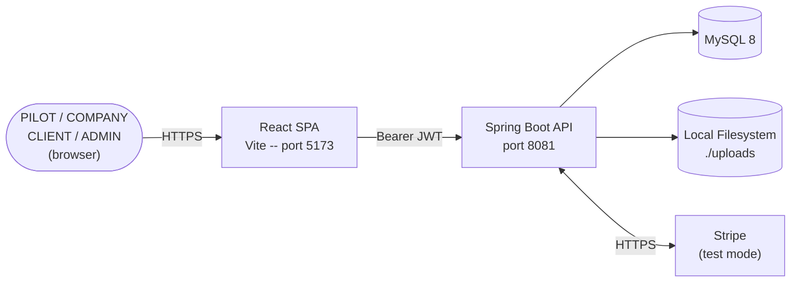

# PED AERIAL - Operator Flight Check

A full-stack drone services platform for insurance inspection workflows.


---

## Overview

PED AERIAL -- Operator Flight Check is a multi-tenant web platform that connects licensed Part 107 drone pilots with insurance companies and individual clients who need aerial inspection and imagery services. The platform manages four user roles -- PILOT, COMPANY, CLIENT, and ADMIN -- and tracks the complete service delivery lifecycle: a requester submits a scoped job request with line items; a pilot reviews and accepts, triggering automatic creation of a job record and service agreement; the pilot executes one or more flight missions, uploads tagged documents, and for insurance jobs produces a structured inspection report; and the engagement closes with an itemized invoice paid via Stripe Checkout.

This is an academic capstone project (UCI 2123, Systems Engineering with AWS) that demonstrates end-to-end full-stack engineering: multi-role JWT authentication, a normalized 18-table relational data model managed exclusively by Flyway migrations, multipart document management with streaming download, server-side PDF generation via OpenPDF, Stripe payment integration with a graceful mock fallback, and role-based access control enforced at the Spring Security filter layer before any controller code executes.

---

## Features

### For Pilots

- Maintain a public profile with bio, certifications, years of experience, and accepting-jobs availability flag
- Register each aircraft in a drone fleet with FAA registration number, weight, and operational wind and gust limits
- Review incoming job requests, submit an accept or reject decision with notes, and have the system automatically generate a job record and service agreement on acceptance
- Schedule individual flight missions per job and log per-mission weather observations (temperature, wind speed, gust speed, conditions, visibility, fly score)
- Upload documents tagged by category (aerial photo, thermal scan, report) and mark files as client deliverables
- Create itemized invoices, advance invoice status from DRAFT to SENT, and generate downloadable PDF copies for clients

### For Insurance Companies

- Submit inspection job requests with structured insurance fields: claim number, policy number, adjuster contact, loss type, property type, and site coordinates
- Select service line items from the master service catalog when building a request
- Monitor all submitted requests by status -- Pending, Accepted, and History -- from a single dashboard
- Review a pilot's completed inspection report covering property condition, damage findings, roof and exterior condition ratings, and record an APPROVED or REJECTED decision with reviewer notes
- Pay outstanding invoices via Stripe Checkout and receive a payment confirmation without leaving the platform

### For Clients

- Register an account and submit job requests for general drone services such as real estate photography, construction mapping, or event coverage
- Track submitted requests and receive notification when a pilot has accepted and scheduled the work
- View and download the PDF service agreement generated automatically when a job is accepted
- Access an archive of completed engagements to download invoice PDFs and confirm payment status

### Platform-Wide

- Stateless JWT authentication with BCrypt password hashing; role encoded in the bearer token and enforced at the Spring Security authorization filter
- Rate limiting on authentication endpoints to prevent credential-stuffing attacks, configurable by environment variable
- Interactive API documentation via Swagger UI at `/swagger-ui.html` when the backend is running
- Role-aware dashboard presenting stats tailored to each role: pilot mission counts and revenue, company open-request totals, client pending and awaiting-payment counts
- Admin controls for service catalog management, cross-platform job request visibility, and second-level inspection report approval

---

## Architecture

PED AERIAL is a three-tier web application: a React 18 single-page application running in the browser, a Spring Boot 3.5 REST API on port 8081, and a MySQL 8 database. Authentication is stateless -- every protected request carries a JWT bearer token validated by a custom filter chain. Two custom filters run before Spring Security's standard pipeline: `AuthRateLimitFilter` gates only `/api/auth/**` endpoints to block credential stuffing, and `JwtAuthenticationFilter` validates the token and populates the security context. Role-based URL rules are declared in `SecurityConfig` and enforced by Spring Security's authorization filter before any controller executes. External integrations include Stripe (test-mode payment checkout and webhook handling), Open-Meteo (7-day weather forecast, called browser-direct with no key), and Nominatim OSM (address autocomplete, also browser-direct). Uploaded documents are written to a local `./uploads` directory; invoice and agreement PDFs are generated by OpenPDF and stored in `./uploads/pdfs`. Schema evolution is managed exclusively by Flyway versioned migration scripts (V1 through V4).

For a full system diagram, security filter chain, and authorization rule matrix, see [docs/architecture-diagram.md](docs/architecture-diagram.md).



---

## Tech Stack

| Layer | Technology | Version | Purpose |
|---|---|---|---|
| Frontend framework | React | 18.3.1 | SPA component model |
| Frontend build | Vite | 6.2.4 | Dev server (port 5173), production build |
| Frontend routing | React Router v6 | 6.30.0 | Client-side routing and role guards |
| HTTP client | Axios | 1.9.0 | API calls; request interceptor attaches JWT |
| Map rendering | Leaflet | 1.9.4 | Job site map display |
| Map React bindings | react-leaflet | 4.2.1 | React component wrapper for Leaflet |
| Icon library | lucide-react | 1.7.0 | UI icons |
| CSS framework | Tailwind CSS | 3.4.17 | Utility-first styling |
| CSS post-processing | PostCSS | 8.5.3 | Tailwind and autoprefixer pipeline |
| CSS autoprefixer | Autoprefixer | 10.4.21 | Vendor prefix injection |
| Backend framework | Spring Boot | 3.5.0 | REST API, DI, auto-configuration |
| Security | Spring Security | (Spring Boot BOM) | Filter chain, authorization, BCrypt |
| JWT | jjwt (io.jsonwebtoken) | 0.11.5 | JWT creation, parsing, signature validation |
| Persistence | Spring Data JPA + Hibernate | (Spring Boot BOM) | ORM and repository layer |
| Database (production) | MySQL Connector/J | (Spring Boot BOM) | JDBC driver for MySQL 8 |
| Database (local dev) | H2 | (Spring Boot BOM) | In-memory DB for local profile |
| Connection pool | HikariCP | (Spring Boot default) | JDBC connection pooling |
| Schema migrations | Flyway (core + mysql) | (Spring Boot BOM) | Versioned, reproducible schema evolution |
| API documentation | springdoc-openapi | 2.8.16 | OpenAPI 3 spec and Swagger UI |
| Build tool | Maven | (wrapper) | Dependency management, build lifecycle |
| Lombok | Lombok | (Spring Boot BOM) | Boilerplate reduction for entities and DTOs |
| PDF generation | OpenPDF (com.github.librepdf) | 2.0.3 | Server-side invoice and agreement PDF rendering |
| Payment | Stripe Java SDK | 26.12.0 | Checkout session creation, webhook signature verification |
| Test framework | JUnit 5 + Mockito | (Spring Boot BOM) | Unit and integration tests |
| Security testing | Spring Security Test | (Spring Boot BOM) | MockMvc with full filter chain |
| Coverage | JaCoCo | 0.8.12 | XML and HTML coverage reports |

---

## Project Structure

```
operator-flight-check/
  backend/
    src/
      main/
        java/com/pedaerial/operatorflightcheck/
          config/          - Security, CORS, OpenAPI configuration
          controller/      - REST controllers (15 total)
          dto/             - Request and response DTOs
          entity/          - JPA entities (18 tables)
          exception/       - Custom exceptions and global handler
          repository/      - Spring Data JPA repositories
          security/        - JWT filter, rate limiter, UserDetailsService
          service/         - Business logic
        resources/
          application.properties
          application-demo.properties
          application-local.properties
          application-mysql.properties
          db/migration/    - Flyway migrations (V1 through V4)
      test/                - JUnit and MockMvc tests
    pom.xml
  frontend/
    src/
      assets/
      components/          - Reusable UI and feature components
      context/             - AuthContext and related providers
      hooks/               - Custom React hooks
      pages/               - Route-level page components (19 pages)
      services/            - Axios-based API service modules
      styles/              - Global CSS and theme variables
      utils/               - Helpers (role routing, formatters)
    package.json
    vite.config.js
  docs/
    project-proposal.md
    architecture-diagram.md
    erd.md
    api-design.md
    code-coverage-report.md
    deployment-guide.md
    sonarqube-analysis.md
  postman/                 - Postman API collection
  buildspec.yml
  docker-compose.sonarqube.yml
  README.md
```

---

## Getting Started

### Prerequisites

- Java 17+
- Node.js 18+
- Maven 3.8+
- MySQL 8.0+ (or use the local H2 profile without MySQL)
- Optional: Stripe test keys for payment integration (mock fallback available if absent)

### Backend Setup

```bash
cd backend

# Set environment variables (or create backend/local.properties with key=value pairs)
export DB_URL="jdbc:mysql://localhost:3306/operator_flight_check"
export DB_USERNAME=root
export DB_PASSWORD=yourpassword
export JWT_SECRET="a-long-random-256-bit-secret"
export APP_SECURITY_ALLOWED_ORIGINS="http://localhost:5173"

# Optional integrations (leave unset for mock or disabled behavior)
export STRIPE_SECRET_KEY=""
export STRIPE_WEBHOOK_SECRET=""
export STRIPE_SUCCESS_URL="http://localhost:5173/payment/success"
export STRIPE_CANCEL_URL="http://localhost:5173/payment/cancel"

# Database schema is managed by Flyway.
# On first run it applies V1 through V4 automatically against the configured database.
# Flyway owns the schema. Do NOT apply DDL manually.

# Build and run
mvn clean install
mvn spring-boot:run
```

Backend listens on port **8081**.

To run with the local H2 in-memory database (no MySQL required):

```bash
mvn spring-boot:run -Dspring-boot.run.profiles=local
```

### Frontend Setup

```bash
cd frontend

npm install

# Create a .env file pointing to the backend
echo "VITE_API_URL=http://localhost:8081/api" > .env

npm run dev
```

Frontend dev server runs at `http://localhost:5173`.

---

## Configuration Reference

| Variable | Required | Default | Purpose |
|---|---|---|---|
| `DB_URL` | No | `jdbc:mysql://localhost:3306/operator_flight_check` | MySQL JDBC connection URL |
| `DB_USERNAME` | No | `root` | MySQL username |
| `DB_PASSWORD` | No | `root` | MySQL password |
| `JWT_SECRET` | Yes | none | Secret key for signing JWTs (256-bit minimum); application will not start if missing |
| `APP_SECURITY_ALLOWED_ORIGINS` | No | `http://localhost:5173,http://127.0.0.1:5173` | CORS allowed origins; separate multiple with commas |
| `APP_SECURITY_AUTH_RATE_LIMIT_MAX_REQUESTS` | No | `10` | Maximum authentication requests allowed per rate-limit window |
| `APP_SECURITY_AUTH_RATE_LIMIT_WINDOW_SECONDS` | No | `60` | Rate-limit window duration in seconds |
| `OPENWEATHER_API_KEY` | No | (empty) | Present in application.properties but unused by the backend; weather data is fetched browser-direct from Open-Meteo |
| `STRIPE_SECRET_KEY` | No | (empty) | Stripe secret key for payment checkout; if absent, a mock checkout session is returned instead |
| `STRIPE_WEBHOOK_SECRET` | No | (empty) | Stripe webhook signing secret used to verify `Stripe-Signature` headers on `POST /api/payments/webhook` |
| `STRIPE_SUCCESS_URL` | No | `http://localhost:5173/payment/success` | Redirect URL after a successful Stripe payment |
| `STRIPE_CANCEL_URL` | No | `http://localhost:5173/payment/cancel` | Redirect URL after a cancelled Stripe payment |
| `APP_PDF_OUTPUT_DIR` | No | `./uploads/pdfs` | Directory where generated invoice and agreement PDFs are written |
| `app.upload.dir` | No | `./uploads` | Directory where uploaded documents are stored |
| `VITE_API_URL` | Yes (frontend) | none | Backend API base URL; set in `frontend/.env` |

---

## API Overview

Full API reference is in [docs/api-design.md](docs/api-design.md) (note: that document will be refreshed in the next documentation phase). When the backend is running, interactive documentation is available via Swagger UI at `http://localhost:8081/swagger-ui.html`, powered by springdoc-openapi from the OpenAPI 3 spec at `/v3/api-docs`.

The table below shows the major resource groups. Each group maps to one of the 15 REST controllers. Use Swagger UI for the full per-endpoint method, path, and request/response schema.

| Resource Group | Base Path | Access |
|---|---|---|
| Authentication | /api/auth | Public |
| Service catalog | /api/service-catalog | Authenticated (reads), PILOT/ADMIN (writes) |
| Pilot-specific routes | /api/pilot/... | PILOT role |
| Client directory | /api/clients | PILOT role (scoped per pilot) |
| Drone fleet | /api/drones | Authenticated (PILOT ownership enforced) |
| Job requests | /api/job-requests | Authenticated; accept/reject restricted to PILOT/ADMIN |
| Jobs | /api/jobs | PILOT, COMPANY, CLIENT, ADMIN |
| Missions | /api/missions | Authenticated |
| Documents | /api/documents | Authenticated |
| Inspection reports | /api/inspection-reports | Authenticated |
| Invoices | /api/invoices | Authenticated |
| Payments | /api/payments | Authenticated (webhook endpoint is public) |
| Agreements | /api/agreements | Authenticated |
| Dashboard | /api/dashboard | Authenticated |
| User profile | /api/profile | Authenticated |
| Admin | /api/admin | ADMIN role |
| Health | /api/health | Public |

---

## Testing

```bash
cd backend

# Run all tests
mvn test

# Run tests with coverage report
mvn clean test jacoco:report
# Report opens at: backend/target/site/jacoco/index.html
```

The test suite currently runs 54 tests (0 failures, 0 errors, 0 skipped) with a line coverage baseline of 30.6% and branch coverage of 17.7%. Security package coverage is the strongest at 88.0% line coverage, reflecting the MockMvc integration tests that verify role-based authorization rules against the full Spring Security filter chain. Service and controller coverage is lower. Phase 3 of the project roadmap targets 70%+ backend coverage by adding MockMvc tests for `JobController`, `InvoiceController`, `DocumentController`, and `JobRequestController`, plus focused service-layer unit tests for request submission, mapping, and payment flows.

For the full per-package breakdown and coverage gap analysis, see [docs/code-coverage-report.md](docs/code-coverage-report.md).

---

## Documentation

- [Project Proposal](docs/project-proposal.md)
- [System Architecture](docs/architecture-diagram.md)
- [Entity Relationship Diagram](docs/erd.md)
- [API Design](docs/api-design.md)
- [Code Coverage Report](docs/code-coverage-report.md)
- [Deployment Guide](docs/deployment-guide.md)
- [SonarQube Analysis](docs/sonarqube-analysis.md)

---

## Project Status

This is an academic capstone project (UCI 2123), not a production product. The insurance inspection pivot is complete, documentation has been refreshed across the proposal, architecture, ERD, and coverage report, and the project is currently in the testing phase targeting 70%+ backend coverage. The application is not deployed publicly and runs locally only; no cloud hosting exists.

---

## Author

Phillip Dowdy
UCI 2123 -- Systems Engineering with AWS (Capstone Project)

---

## License

This project is an academic capstone. All rights reserved for academic evaluation purposes.
