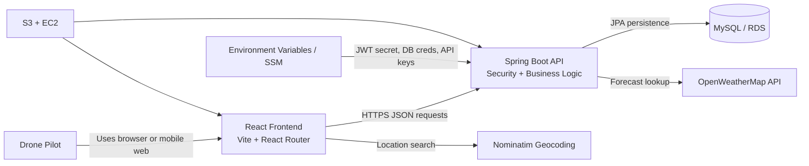

# Architecture Diagram

## System Context

## Data Flow Notes

- The React frontend handles routing, authenticated navigation, and forecast presentation.
- The Spring Boot backend validates requests, applies business rules, and issues JWTs.
- MySQL stores users, drone profiles, saved spots, and spot-check history.
- OpenWeatherMap provides weather inputs used for flyability scoring.
- Nominatim resolves human-readable place searches into coordinates.
- Deployment can map the frontend to S3 static hosting and the API to EC2, with secrets injected via environment variables or AWS Systems Manager Parameter Store.
