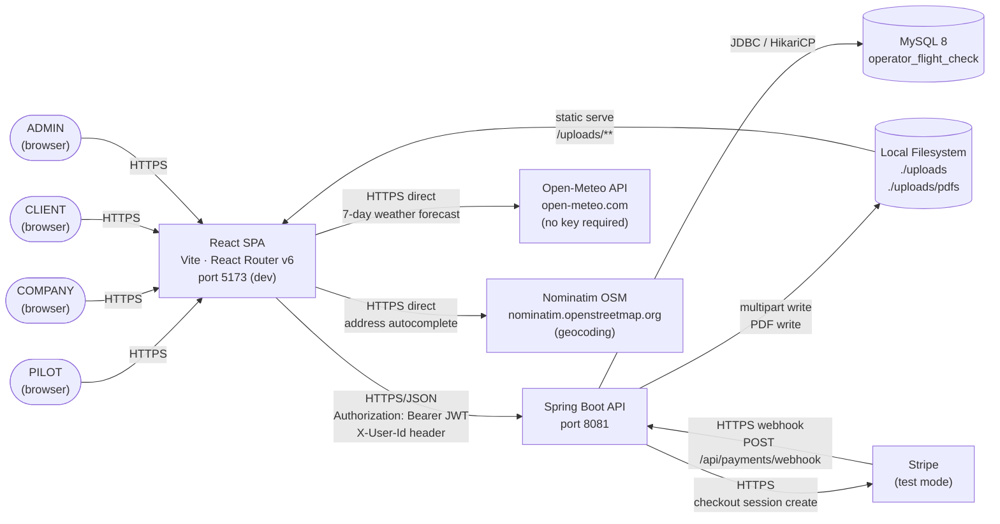
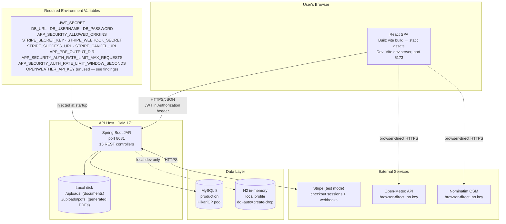
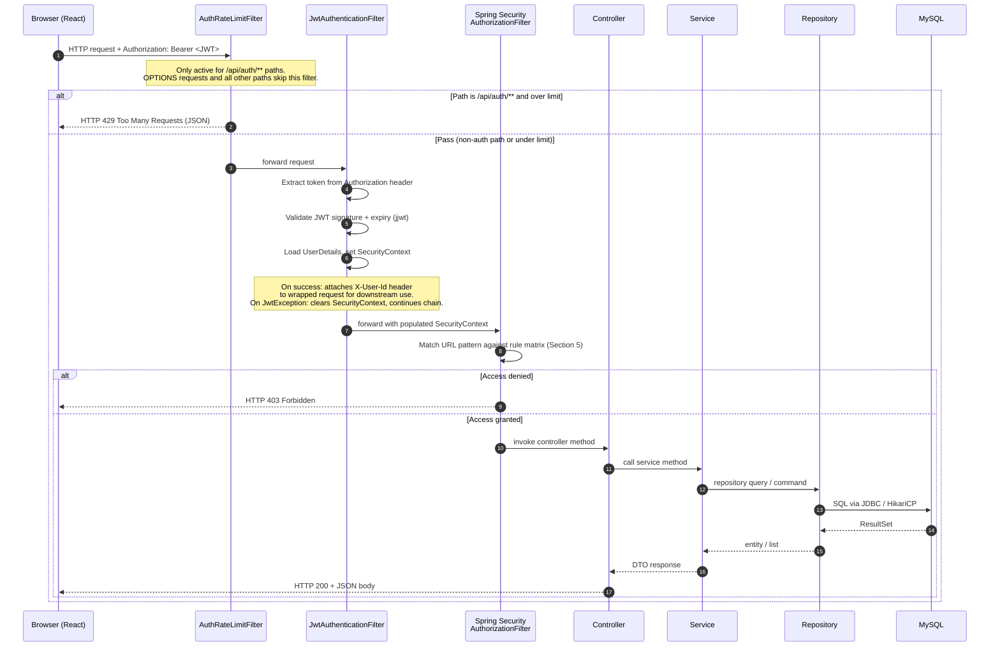
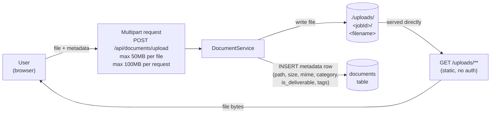

# System Architecture — PED AERIAL (Operator Flight Check)

PED AERIAL is a three-tier web application: a React 18 single-page application running in the user's browser, a Spring Boot 3 REST API running on port 8081, and a MySQL 8 database. Authentication is stateless — every protected API request carries a JWT bearer token validated by a custom filter chain that runs before Spring Security's standard authentication pipeline. Role-based URL rules (PILOT, COMPANY, CLIENT, ADMIN) are declared in `SecurityConfig` and enforced by Spring Security's authorization filter before any controller code executes. External integrations include Stripe (test-mode payment checkout and webhook handling), Open-Meteo (weather forecast data, called directly from the browser with no key required), and Nominatim OSM geocoding (address search, also browser-direct). File documents uploaded by pilots are written to a local `./uploads` directory on the API host; PDFs for invoices and agreements are generated by OpenPDF and stored in `./uploads/pdfs`.

The project runs locally in development with Vite's dev server on port 5173 and Spring Boot on port 8081, with secrets supplied via environment variables or an optional `./local.properties` override file. No cloud deployment exists — the application is a capstone project and has not been hosted in production. A production deployment model would consist of a static-hosted React build (CDN or any static host), a containerized or VM-hosted Spring Boot JAR, and a managed MySQL instance; file storage would migrate from local disk to an object storage service such as S3. All secrets are externalized as environment variables with safe defaults for non-sensitive properties; `JWT_SECRET` has no default and the application will fail to start if it is missing.

---

## System Context Diagram



**Note:** Open-Meteo and Nominatim are called directly from the user's browser — the Spring Boot API is not in the path for those calls. Stripe webhooks arrive at the backend on a publicly accessible endpoint (`/api/payments/webhook`) that is exempt from JWT authentication by design.

---

## Deployment View



*Dashed arrows indicate conditional paths (H2 only when the `local` profile is active; Open-Meteo and Nominatim are browser-side only).*

---

## Request Lifecycle & Security Model



### Filter Chain Explanation

The security filter chain registers two custom filters before Spring Security's `UsernamePasswordAuthenticationFilter`. Both are registered via `addFilterBefore(filter, UsernamePasswordAuthenticationFilter.class)` in `SecurityConfig`, with `AuthRateLimitFilter` registered first and `JwtAuthenticationFilter` registered second.

**`AuthRateLimitFilter`** (first) is a `OncePerRequestFilter` that uses an in-memory `ConcurrentHashMap` to track request timestamps per `(IP address, URI)` key. Its `shouldNotFilter` method returns `true` for all requests that are not `POST`/`GET`/etc. to `/api/auth/**` and for all `OPTIONS` requests — meaning it is functionally a no-op for the vast majority of API calls and only activates on the authentication endpoints to prevent credential-stuffing attacks. Default limits are 10 requests per 60-second window, both configurable via environment variables.

**`JwtAuthenticationFilter`** (second) extracts the `Authorization: Bearer <token>` header, validates the JWT using `jjwt`, loads the user from the database, and populates `SecurityContextHolder` with a `UsernamePasswordAuthenticationToken` bearing the user's granted authorities. It also wraps the request to attach an `X-User-Id` header so controllers can reference the authenticated user's ID without re-parsing the token. On a `JwtException` the context is cleared and the request continues unauthenticated (it will be rejected by the authorization filter if the endpoint requires auth).

**Spring Security's authorization layer** then evaluates the request against the URL rule matrix declared in `SecurityConfig.authorizeHttpRequests()` (see Section 5). Session creation is set to `STATELESS`, so no HTTP session is ever created or consulted. Password verification at login uses a `DaoAuthenticationProvider` backed by BCrypt.

`@EnableMethodSecurity` is active on `SecurityConfig`, enabling `@PreAuthorize` annotations at the controller method level for cases where URL-pattern rules are not sufficiently granular.

---

## Authorization Rule Matrix

Every rule below is transcribed verbatim from `SecurityConfig.securityFilterChain()`. Spring Security evaluates rules top to bottom and stops at the first match.

| Pattern | HTTP Method | Access | Notes |
|---|---|---|---|
| `/**` | `OPTIONS` | `permitAll` | CORS preflight — must be unauthenticated so the browser can complete the handshake |
| `/actuator/health` | any | `permitAll` | Spring Boot Actuator health probe |
| `/api/health` | any | `permitAll` | Custom health endpoint |
| `/api/auth/**` | any | `permitAll` | Login and registration; rate-limited by `AuthRateLimitFilter` |
| `/v3/api-docs/**` | any | `permitAll` | OpenAPI 3 spec (springdoc-openapi) |
| `/swagger-ui/**` | any | `permitAll` | Swagger UI static assets |
| `/swagger-ui.html` | any | `permitAll` | Swagger UI entry point |
| `/uploads/**` | any | `permitAll` | Uploaded files served directly; no auth — see Section 8 for the known limitation |
| `/api/payments/webhook` | any | `permitAll` | Stripe webhook — cannot carry a JWT; signature verified inside the handler instead |
| `/api/admin/**` | any | `hasRole("ADMIN")` | Reserved for admin-only operations |
| `/api/pilot/**` | any | `hasRole("PILOT")` | Reserved for pilot-only operations |
| `/api/company/**` | any | `hasRole("COMPANY")` | Reserved for company-only operations |
| `/api/jobs/**` | any | `hasAnyRole("PILOT","COMPANY","CLIENT","ADMIN")` | All four roles may access job records |
| `/api/documents/**` | any | `authenticated` | Any authenticated user; service layer enforces ownership |
| `/api/service-catalog/active` | any | `authenticated` | Public active catalog listing; more permissive than the parent pattern below |
| `/api/service-catalog/**` | any | `hasAnyRole("PILOT","ADMIN")` | Full catalog management restricted to pilots and admins |
| `/api/job-requests/*/decide` | any | `hasAnyRole("PILOT","ADMIN")` | Accept/reject decision — requesters cannot decide their own requests |
| `/api/job-requests/all` | any | `hasAnyRole("PILOT","ADMIN")` | Full request list across all requesters |
| `/api/job-requests/**` | any | `authenticated` | Submit, view own requests, cancel |
| `/api/payments/**` | any | `authenticated` | Checkout session creation (webhook excluded above) |
| `/api/agreements/**` | any | `authenticated` | View and download agreements |
| `/api/profile/**` | any | `authenticated` | User profile read/update |
| `/**` (fallback) | any | `authenticated` | Catch-all; any unmatched endpoint requires a valid JWT |

CORS is configured to allow origins from `APP_SECURITY_ALLOWED_ORIGINS` (default: `http://localhost:5173,http://127.0.0.1:5173`), methods `GET POST PUT PATCH DELETE OPTIONS`, headers `Authorization Content-Type X-User-Id`, exposed response header `Location`, and credentials (`allowCredentials = true`).

---

## Data Layer & Migration Flow

**Production** uses MySQL 8 accessed via the MySQL Connector/J driver, with HikariCP as the connection pool (Spring Boot default). `spring.jpa.hibernate.ddl-auto=validate` means Hibernate performs a schema validation check at startup — if entity definitions don't match the live schema the application refuses to start. Schema evolution is owned exclusively by Flyway.

**Local / H2 profile** (`application-local.properties`) swaps to an H2 in-memory database (`jdbc:h2:mem:operatorflightcheck;MODE=MySQL`) with `ddl-auto=create-drop` and Flyway disabled. Hibernate creates and drops the schema from entity annotations. This profile is used for local development without a running MySQL instance.

**Flyway** (`spring.flyway.locations=classpath:db/migration`, `baseline-on-migrate=true`, `baseline-version=0`) manages all schema changes in production. Current migrations:

| File | Description |
|---|---|
| `V1__baseline_schema.sql` | Creates 11 tables: `users`, `clients`, `drone_profiles`, `jobs`, `insurance_details` (later removed), `missions`, `inspection_reports`, `invoices`, `line_items`, `payments`, `documents`; adds 11 FK-path indexes |
| `V2__rename_insurance_to_company.sql` | Renames `INSURANCE` → `COMPANY` in `users.role` and `INSURANCE_COMPANY` → `COMPANY` in `clients.client_type`; alters column types to plain VARCHAR to decouple from MySQL ENUM syntax |
| `V3__data_model_pivot.sql` | Expands `users` with 10 business/billing profile columns; denormalizes insurance-claim fields from the old `insurance_details` table into `jobs`; drops `insurance_details`; creates `service_catalog`, `job_requests`, `job_request_line_items` (with original `service_catalog_id` FK), and `agreements` |
| `V4__pilot_profile_and_services.sql` | Creates `pilot_profiles`, `pilot_services`, `weekly_schedules`, `availability_exceptions`; adds `category` column to `service_catalog`; swaps `job_request_line_items` FK from `service_catalog_id` → `pilot_service_id`; seeds 20 master service catalog entries |

The fully migrated schema contains **18 entity tables**. For the complete column-level reference and all relationships see [`docs/erd.md`](erd.md).

---

## External Integrations

### Stripe (test mode)

Checkout is initiated by the frontend calling `POST /api/payments/checkout-session/{invoiceId}`. The `PaymentService` validates access rights, then delegates to `StripeService.createCheckoutSession()`. If `STRIPE_SECRET_KEY` is configured, the backend creates a real Stripe Checkout Session and returns a redirect URL to the Stripe-hosted payment page. If the key is absent or blank, `StripeService` logs a warning (`"Stripe API key not configured — checkout will return mock sessions"`) and returns a mock session that redirects directly to the success URL with `?mock=true`.

After the user pays on Stripe's page, Stripe posts a `checkout.session.completed` event to `POST /api/payments/webhook`. This endpoint is listed as `permitAll` in `SecurityConfig` because Stripe cannot sign requests with an application JWT — instead, the handler calls `Webhook.constructEvent()` to verify the `Stripe-Signature` header against `STRIPE_WEBHOOK_SECRET`. On successful verification, `PaymentService.handleWebhookEvent()` extracts the invoice ID from the event metadata, sets the invoice status to `PAID`, sets the paid date, and creates a `Payment` record with `method = CREDIT_CARD` and reference note `"Stripe checkout.session.completed"`.

```
Client                Spring Boot            Stripe
  │                       │                    │
  │  POST /checkout-session│                    │
  │──────────────────────►│                    │
  │                       │── createSession ──►│
  │                       │◄── {url, id} ──────│
  │◄── {url} ─────────────│                    │
  │                       │                    │
  │─── redirect to Stripe ──────────────────►  │
  │◄── payment page ────────────────────────   │
  │                       │                    │
  │  (user pays)          │                    │
  │                       │◄── POST /webhook ──│
  │                       │  (sig verified)    │
  │                       │── invoice PAID ──► │(internal)
  │◄── redirect success ──────────────────── │
```

### Open-Meteo Weather API

Weather data is fetched **directly from the user's browser** — the Spring Boot API is not involved. The `weatherService.js` module calls `https://api.open-meteo.com/v1/forecast` with latitude, longitude, and a 7-day forecast request (wind speed, wind gusts, precipitation probability, weather code). No API key is required; Open-Meteo is a free, open-access service. The response is used on weather/mission planning pages to display a fly score computed from wind, gust, and precipitation values. Weather data is not persisted through the API — per-mission conditions that the pilot logs manually are stored in the `missions` table by the backend.

The `openweather.api.key=${OPENWEATHER_API_KEY:}` property in `application.properties` is present but not used by any backend service. It is a dead configuration artifact; see out-of-scope findings.

### Nominatim OSM Geocoding

Address autocomplete is also fetched **directly from the user's browser** via the `AddressFields` frontend component. The component calls `https://nominatim.openstreetmap.org/search?format=json&addressdetails=1&limit=6&countrycodes=us&q=<query>` with a 1.1-second debounce (enforced by the component to respect Nominatim's usage policy). No API key is required. Geocoded coordinates are then embedded in the job request form submission sent to the backend.

---

## File Storage & Document Flow

Uploaded files (aerial photos, videos, PDFs, reports) and server-generated PDFs (invoices, agreements) are stored on the API host's local filesystem.



**PDF generation** is handled server-side by OpenPDF (com.github.librepdf). `PdfGenerationService` writes:
- Invoice PDFs to `./uploads/pdfs/invoices/invoice-<id>.pdf`
- Agreement PDFs to `./uploads/pdfs/agreements/agreement-<id>.pdf`

Both are served via the `/uploads/**` static path under Spring's default resource handler after the controller streams them from disk as a `PathResource` with `Content-Disposition: attachment`.

**Known limitation:** Serving uploaded files from `/uploads/**` with `permitAll` means any user who guesses or obtains a file path can download it without authentication. For a production system, this would be replaced by pre-signed URLs from an object storage service (e.g., S3), keeping actual file data behind access control while still allowing short-lived direct downloads.

**Scaling limitation:** Local disk storage is bound to a single host. A horizontally scaled deployment would require shared storage (network filesystem or object store) to prevent documents uploaded to one instance from being invisible to another.

---

## Technology Stack Summary

| Layer | Technology | Version | Purpose |
|---|---|---|---|
| Frontend framework | React | 18.3.1 | SPA component model |
| Frontend build | Vite | 6.2.4 | Dev server (port 5173), production build |
| Frontend routing | React Router v6 | 6.30.0 | Client-side routing, `ProtectedRoute`, role guards |
| HTTP client | Axios | 1.9.0 | API calls; request interceptor attaches JWT and X-User-Id; response interceptor clears token on 401 |
| Map rendering | Leaflet + react-leaflet | 1.9.4 / 4.2.1 | Job site map on pilot dashboard |
| Icon library | lucide-react | 1.7.0 | UI icons |
| CSS framework | Tailwind CSS | 3.4.17 | Utility-first styling (dev dependency) |
| Backend framework | Spring Boot | 3.5.0 | REST API, dependency injection, auto-configuration |
| Security | Spring Security | (Spring Boot BOM) | Filter chain, authorization, BCrypt via `DaoAuthenticationProvider` |
| JWT | jjwt (io.jsonwebtoken) | 0.11.5 | JWT creation, parsing, signature validation |
| Persistence | Spring Data JPA + Hibernate | (Spring Boot BOM) | ORM, repository layer |
| Database (prod) | MySQL Connector/J | (Spring Boot BOM) | JDBC driver for MySQL 8 |
| Database (dev/test) | H2 | (Spring Boot BOM) | In-memory DB for local profile (`application-local.properties`) |
| Connection pool | HikariCP | (Spring Boot default) | JDBC connection pooling |
| Schema migrations | Flyway (core + mysql) | (Spring Boot BOM) | Versioned, reproducible schema evolution |
| API documentation | springdoc-openapi | 2.8.16 | OpenAPI 3 spec at `/v3/api-docs`, Swagger UI |
| Build tool | Maven | (wrapper) | Dependency management, build lifecycle |
| PDF generation | OpenPDF (com.github.librepdf) | 2.0.3 | Server-side invoice and agreement PDF rendering |
| Payment | Stripe Java SDK | 26.12.0 | Checkout session creation, webhook signature verification |
| Weather (frontend) | Open-Meteo API | — | Browser-direct 7-day forecast, no key required |
| Geocoding (frontend) | Nominatim OSM | — | Browser-direct address autocomplete, no key required |
| Test framework | JUnit 5 + Mockito + MockMvc | (Spring Boot BOM) | Unit, integration, and security filter tests |
| Coverage | JaCoCo | 0.8.12 | XML + HTML coverage reports on `mvn test` |
| Static analysis | SonarCloud (sonar-maven-plugin) | 3.11.0.3922 | Code quality gate (CI) |

---

## Architectural Decisions

- **Stateless JWT over server-side sessions.** No `HttpSession` is ever created (`SessionCreationPolicy.STATELESS`). Every request is self-contained via the bearer token. This allows the API to scale horizontally without sticky sessions or shared session storage.

- **Two-filter chain: rate limiter before JWT validator.** `AuthRateLimitFilter` is registered first and gates only `/api/auth/**` endpoints; `JwtAuthenticationFilter` is registered second and runs on all requests. The rate limiter is intentionally narrow — applying it to every endpoint would penalize legitimate users; applying it only to auth endpoints blocks credential-stuffing attacks at the point where they matter.

- **`@EnableMethodSecurity` for fine-grained control.** URL-pattern rules cover coarse role boundaries. `@EnableMethodSecurity` allows individual controller methods to carry `@PreAuthorize` annotations for ownership checks and edge cases that can't be expressed cleanly as URL patterns (e.g., a pilot may only update their own client records, not another pilot's).

- **BCrypt password hashing via `DaoAuthenticationProvider`.** Industry-standard adaptive cost function. The cost factor is the jjwt default; it can be tuned without changing the architecture.

- **Flyway for schema migrations; `ddl-auto=validate` in production.** Hibernate is forbidden from modifying the schema. Flyway provides a reproducible, version-controlled migration history. The `validate` mode causes the application to fail fast at startup if the code model and the database schema diverge — preventing silent corruption.

- **Webhook endpoint publicly accessible.** `POST /api/payments/webhook` is listed as `permitAll` in `SecurityConfig`. Stripe webhooks arrive from Stripe's servers, which cannot present a user JWT. Instead, the handler calls `Stripe.Webhook.constructEvent()` to verify the `Stripe-Signature` header against `STRIPE_WEBHOOK_SECRET`. The endpoint is effectively authenticated by request signature rather than bearer token.

- **Stripe mock fallback when key is absent.** `StripeService.init()` checks `STRIPE_SECRET_KEY` at startup. If absent, it logs a warning and subsequent `createCheckoutSession` calls return a mock result that redirects to the success URL with `?mock=true`. This allows the full UI payment flow to be tested without live Stripe credentials.

- **Local disk file storage (acknowledged scaling limitation).** Document files and generated PDFs are stored on the API host's filesystem. This is pragmatic for a capstone project where a single-host deployment is the target. In a production multi-instance deployment, this would be replaced by shared object storage (S3 or equivalent) to prevent file-not-found errors when a request lands on a different host than the one that accepted the upload.

- **Open-Meteo and Nominatim called browser-direct, no backend proxy.** Both services are free and require no API key, so there is no credential to protect and no reason to route through the backend. Browser-direct calls reduce backend load and latency. The tradeoff is that CORS policy for those APIs is outside our control.

- **CORS restricted to configured origins with credentials.** `allowCredentials = true` enables the browser to send cookies and `Authorization` headers cross-origin. Restricting `allowedOrigins` to the configured list (`APP_SECURITY_ALLOWED_ORIGINS`) prevents unknown frontends from making credentialed requests — this is functionally equivalent to CSRF protection in a JWT-stateless architecture because the token is in a header, not a cookie.

- **Separate local H2 profile, not a dedicated test profile.** `application-local.properties` activates H2 in-memory, disables Flyway, and uses `ddl-auto=create-drop`. This lets developers run the application without a MySQL instance but means the Flyway migration SQL is not exercised in this profile — Hibernate builds the schema directly from entity annotations. A dedicated test profile that runs Flyway against H2 would provide stronger migration regression coverage.

---

## Before → After (Phase 2c)

| Criterion | Before | After | Δ | Evidence |
|---|---:|---:|---:|---|
| System Architecture Design | 3 | 5 | +2 | docs/architecture-diagram.md — 4 Mermaid diagrams (context, deployment, sequence, file flow), full filter chain and URL rule matrix matching SecurityConfig.java, real integration flows for Stripe and file storage, technology stack with actual versions |

### Revised Running Total

- Before Phase 2c: 70 / 85
- After Phase 2c: **72 / 85**
- Delta: **+2**

---

## Out-of-Scope Findings

Observed while reading config and security files — not fixed, only listed.

1. **`openweather.api.key` is dead configuration.** `application.properties` declares `openweather.api.key=${OPENWEATHER_API_KEY:}` but no backend service class reads this property. The frontend `weatherService.js` calls Open-Meteo (`open-meteo.com`) directly from the browser — a different provider that requires no key. The `OPENWEATHER_API_KEY` environment variable has no effect. This property should either be removed or replaced with an Open-Meteo-aware configuration if backend weather proxying is ever added.

2. **`application-local.properties` disables Flyway.** The H2 profile uses `spring.flyway.enabled=false` and `ddl-auto=create-drop`, meaning Hibernate builds the schema from entity annotations rather than running the Flyway migrations. The Flyway SQL (V1–V4) is therefore not exercised in the local H2 environment. A migration regression (e.g., a column renamed in Java but not in SQL) would not be caught until the application is run against a real MySQL instance.

3. **`/uploads/**` is publicly accessible without authentication.** Any client that knows (or can guess) a file path can download uploaded documents without a JWT. The Spring Security rule `permitAll` on this pattern is explicit and intentional (static resource serving), but it means there is no access control on raw uploaded files. For sensitive inspection documents or client deliverables this is a meaningful exposure risk.

4. **Filter registration order ambiguity.** Both `AuthRateLimitFilter` and `JwtAuthenticationFilter` are registered with `.addFilterBefore(..., UsernamePasswordAuthenticationFilter.class)`. When two filters are inserted before the same reference filter, Spring Security's internal ordering behavior for filters at the same position level is implementation-specific. The intended order (rate limit → JWT validate) is consistent with the functional design but is not enforced by explicit ordering integers or `@Order` annotations. A future Spring Security upgrade could theoretically change the tiebreaker behavior.

5. **No `application-test.properties` in resources.** There is no dedicated test Spring profile configuration. Tests likely activate the `local` profile or rely on per-test `@ActiveProfiles` annotations. The Phase 2b proposal assumed H2 is the test database, which is consistent with `application-local.properties`, but the mechanism is the local profile rather than a purpose-built test profile.

---

## Sanity Check

- Did you modify any file other than `docs/architecture-diagram.md`? **No.**
- Does Section 5 URL table match `SecurityConfig.java` rule-for-rule? **Yes** — all 14 `.requestMatchers()` calls from `SecurityConfig.securityFilterChain()` are represented in order.
- Does Section 4 sequence diagram show the filters in the correct order? **Yes** — `AuthRateLimitFilter` appears first (active only on `/api/auth/**`), `JwtAuthenticationFilter` second, then Spring Security's authorization filter.
- Does the doc contain zero references to the old weather-app product framing? **Yes** — no mention of flyability forecast, saved locations, spot checks, or weather-as-product anywhere in the document.
