# Entity Relationship Diagram — PED AERIAL

PED AERIAL is a drone services SaaS platform purpose-built for insurance inspection workflows and general aerial service delivery. The system supports four roles — `PILOT`, `COMPANY`, `CLIENT`, and `ADMIN` — and is organized around 18 core entity tables that span identity, pilot profile management, client relationships, job intake, flight execution, deliverables, and financial operations.

---

## Mermaid ERD

```mermaid
erDiagram

    %% ── Identity & Access ─────────────────────────────────────────
    USERS ||--o| PILOT_PROFILES       : "has profile"
    USERS ||--o{ DRONE_PROFILES       : "owns"
    USERS ||--o{ WEEKLY_SCHEDULES     : "sets availability"
    USERS ||--o{ AVAILABILITY_EXCEPTIONS : "overrides schedule"
    USERS ||--o{ PILOT_SERVICES       : "offers"
    USERS ||--o{ CLIENTS              : "manages"

    %% ── Service Catalog ───────────────────────────────────────────
    SERVICE_CATALOG ||--o{ PILOT_SERVICES : "templates"

    %% ── Work Intake ───────────────────────────────────────────────
    USERS ||--o{ JOB_REQUESTS               : "submits"
    USERS ||--o{ JOB_REQUESTS               : "reviews"
    JOB_REQUESTS ||--o{ JOB_REQUEST_LINE_ITEMS : "contains"
    PILOT_SERVICES ||--o{ JOB_REQUEST_LINE_ITEMS : "priced in"
    JOB_REQUESTS |o--o| JOBS                : "spawns"

    %% ── Job Execution ─────────────────────────────────────────────
    CLIENTS ||--o{ JOBS           : "subject of"
    USERS ||--o{ JOBS             : "assigned pilot"
    JOBS ||--o{ MISSIONS          : "runs"
    DRONE_PROFILES ||--o{ MISSIONS : "used in"

    %% ── Inspection & Deliverables ─────────────────────────────────
    JOBS ||--o| INSPECTION_REPORTS : "yields"
    USERS ||--o{ INSPECTION_REPORTS : "authors"
    USERS ||--o{ INSPECTION_REPORTS : "reviews"
    JOBS ||--o{ DOCUMENTS          : "stores"
    MISSIONS ||--o{ DOCUMENTS      : "sourced from"
    USERS ||--o{ DOCUMENTS         : "uploaded by"

    %% ── Financial ─────────────────────────────────────────────────
    JOBS ||--o| AGREEMENTS     : "governed by"
    JOBS ||--o| INVOICES       : "billed via"
    CLIENTS ||--o{ INVOICES    : "invoiced to"
    USERS ||--o{ INVOICES      : "issued by pilot"
    INVOICES ||--o{ LINE_ITEMS : "itemized as"
    INVOICES ||--o{ PAYMENTS   : "settled by"

    %% ── Table definitions ─────────────────────────────────────────

    USERS {
        char_36   id              PK
        varchar   email           UK
        varchar   password_hash
        enum      role
        varchar   first_name
        varchar   last_name
        varchar   phone
        varchar   company
        varchar   license_number
        varchar   business_name
        varchar   ein
        boolean   llc_verified
        enum      payment_terms
        varchar   billing_address
        varchar   billing_city
        varchar   billing_state
        varchar   billing_zip
        varchar   insurance_policy_number
        varchar   insurance_company_name
        timestamp created_at
    }

    PILOT_PROFILES {
        char_36   id                 PK
        char_36   pilot_id           FK
        text      bio
        varchar   profile_photo_path
        int       years_experience
        text      certifications
        boolean   accepting_jobs
        timestamp created_at
        timestamp updated_at
    }

    DRONE_PROFILES {
        char_36   id               PK
        char_36   pilot_id         FK
        varchar   name
        varchar   manufacturer
        varchar   model
        varchar   serial_number
        varchar   faa_registration
        int       weight_grams
        int       max_wind_mph
        int       max_gust_mph
        text      notes
        boolean   active
        timestamp created_at
    }

    WEEKLY_SCHEDULES {
        char_36 id          PK
        char_36 pilot_id    FK
        enum    day_of_week
        time    start_time
        time    end_time
    }

    AVAILABILITY_EXCEPTIONS {
        char_36 id             PK
        char_36 pilot_id       FK
        date    exception_date
        enum    exception_type
        time    start_time
        time    end_time
        varchar reason
    }

    SERVICE_CATALOG {
        char_36   id                         PK
        enum      job_type
        enum      category
        varchar   name
        text      description
        decimal   base_price
        int       estimated_duration_minutes
        boolean   active
        int       sort_order
        timestamp created_at
        timestamp updated_at
    }

    PILOT_SERVICES {
        char_36   id                         PK
        char_36   pilot_id                   FK
        char_36   catalog_service_id         FK
        varchar   custom_name
        text      custom_description
        enum      job_type
        enum      pricing_type
        decimal   flat_fee
        decimal   hourly_rate
        int       estimated_duration_minutes
        boolean   active
        int       sort_order
        timestamp created_at
        timestamp updated_at
    }

    CLIENTS {
        char_36   id          PK
        char_36   pilot_id    FK
        varchar   name
        varchar   email
        varchar   phone
        varchar   company
        enum      client_type
        varchar   address
        text      notes
        timestamp created_at
        timestamp updated_at
    }

    JOB_REQUESTS {
        char_36   id                    PK
        char_36   requester_id          FK
        char_36   reviewed_by_pilot_id  FK
        enum      status
        varchar   site_address
        decimal   site_lat
        decimal   site_lon
        date      requested_date
        time      requested_time
        boolean   is_recurring
        varchar   recurrence_pattern
        text      notes
        decimal   rate_card_total
        decimal   discount_percent
        decimal   final_amount
        decimal   proposed_budget
        varchar   claim_number
        varchar   policy_number
        varchar   insurance_company_name
        varchar   adjuster_name
        varchar   adjuster_email
        varchar   adjuster_phone
        date      loss_date
        enum      loss_type
        enum      property_type
        text      inspection_scope
        char_36   created_job_id        FK
        timestamp decided_at
        text      decision_notes
        timestamp created_at
        timestamp updated_at
    }

    JOB_REQUEST_LINE_ITEMS {
        char_36 id                    PK
        char_36 job_request_id        FK
        char_36 pilot_service_id      FK
        varchar service_name_snapshot
        decimal unit_price_snapshot
        varchar pricing_type_snapshot
        int     quantity
        decimal amount
        int     sort_order
    }

    JOBS {
        char_36   id                    PK
        char_36   pilot_id              FK
        char_36   client_id             FK
        varchar   title
        text      description
        enum      job_type
        enum      status
        enum      priority
        varchar   site_address
        decimal   site_lat
        decimal   site_lon
        date      scheduled_date
        time      scheduled_time
        int       estimated_duration
        int       actual_duration
        text      notes
        varchar   claim_number
        varchar   policy_number
        varchar   insurance_company_name
        varchar   adjuster_name
        varchar   adjuster_email
        varchar   adjuster_phone
        date      loss_date
        enum      loss_type
        enum      property_type
        text      inspection_scope
        timestamp created_at
        timestamp updated_at
    }

    MISSIONS {
        char_36   id                 PK
        char_36   job_id             FK
        char_36   pilot_id           FK
        char_36   drone_profile_id   FK
        date      flight_date
        time      flight_time
        int       duration_minutes
        double    weather_temp_f
        double    weather_wind_mph
        double    weather_gust_mph
        varchar   weather_conditions
        varchar   weather_visibility
        int       fly_score
        enum      status
        text      notes
        timestamp created_at
    }

    INSPECTION_REPORTS {
        char_36   id                  PK
        char_36   job_id              FK "UK"
        char_36   pilot_id            FK
        date      report_date
        enum      property_condition
        boolean   damage_found
        text      damage_summary
        enum      roof_condition
        enum      exterior_condition
        text      additional_findings
        text      recommendations
        varchar   pilot_signature
        enum      status
        text      reviewer_notes
        char_36   reviewed_by         FK
        timestamp reviewed_at
        timestamp created_at
        timestamp updated_at
    }

    DOCUMENTS {
        char_36   id               PK
        char_36   job_id           FK
        char_36   mission_id       FK
        char_36   uploaded_by      FK
        varchar   file_name
        enum      file_type
        varchar   file_path
        bigint    file_size_bytes
        varchar   thumbnail_path
        varchar   mime_type
        text      description
        varchar   tags
        enum      category
        boolean   is_deliverable
        timestamp created_at
    }

    AGREEMENTS {
        char_36   id               PK
        char_36   job_id           FK "UK"
        varchar   agreement_number UK
        enum      status
        timestamp signed_at
        varchar   signed_by_name
        varchar   signed_by_email
        varchar   pdf_path
        timestamp created_at
    }

    INVOICES {
        char_36   id              PK
        char_36   job_id          FK "UK"
        char_36   pilot_id        FK
        varchar   invoice_number  UK
        char_36   client_id       FK
        decimal   amount
        decimal   tax_amount
        decimal   total_amount
        enum      status
        date      due_date
        date      paid_date
        text      notes
        timestamp created_at
        timestamp updated_at
    }

    LINE_ITEMS {
        char_36 id          PK
        char_36 invoice_id  FK
        varchar description
        decimal quantity
        decimal unit_price
        decimal amount
        int     sort_order
    }

    PAYMENTS {
        char_36   id             PK
        char_36   invoice_id     FK
        decimal   amount
        date      payment_date
        enum      method
        varchar   reference_note
        timestamp created_at
    }
```

---

## Table-by-Table Reference

### 1. Identity & Access

---

### users

Stores all authenticated platform users regardless of role; a single row covers identity, contact info, business/billing profile, and insurance metadata.

| Column | Type | Nullable | Key | Notes |
|---|---|---|---|---|
| id | CHAR(36) | NOT NULL | PK | UUID generated in `@PrePersist`; updatable = false |
| email | VARCHAR(255) | NOT NULL | UK | Validated with `@Email`; unique index `idx_users_email` |
| password_hash | VARCHAR(255) | NOT NULL | | BCrypt hash |
| role | VARCHAR(20) | NOT NULL | | Enum: `PILOT \| COMPANY \| CLIENT \| ADMIN`; default `CLIENT` |
| first_name | VARCHAR(100) | NULL | | |
| last_name | VARCHAR(100) | NULL | | |
| phone | VARCHAR(50) | NULL | | |
| company | VARCHAR(255) | NULL | | Legacy general company field |
| license_number | VARCHAR(50) | NULL | | FAA or other pilot license |
| business_name | VARCHAR(255) | NULL | | Added in V3; formal LLC/business name |
| ein | VARCHAR(50) | NULL | | Employer Identification Number; added in V3 |
| llc_verified | BOOLEAN | NOT NULL | | Added in V3; default `false` |
| payment_terms | VARCHAR(20) | NULL | | Enum: `PREPAY \| NET_30 \| NET_60`; added in V3 |
| billing_address | VARCHAR(500) | NULL | | Added in V3 |
| billing_city | VARCHAR(100) | NULL | | Added in V3 |
| billing_state | VARCHAR(50) | NULL | | Added in V3 |
| billing_zip | VARCHAR(20) | NULL | | Added in V3 |
| insurance_policy_number | VARCHAR(100) | NULL | | Added in V3; user's own policy number |
| insurance_company_name | VARCHAR(255) | NULL | | Added in V3 |
| created_at | TIMESTAMP | NOT NULL | | Set in `@PrePersist`; updatable = false |

**Relationships**
- One `users` row ← zero-or-one `pilot_profiles` (pilot_profiles.pilot_id → users.id, ON DELETE CASCADE)
- One `users` row ← zero-or-many `drone_profiles` (drone_profiles.pilot_id → users.id, ON DELETE CASCADE)
- One `users` row ← zero-or-many `clients` (clients.pilot_id → users.id, ON DELETE CASCADE)
- One `users` row ← zero-or-many `jobs` (jobs.pilot_id → users.id, ON DELETE SET NULL; nullable assignment)
- One `users` row ← zero-or-many `pilot_services` (pilot_services.pilot_id → users.id, ON DELETE CASCADE)
- One `users` row ← zero-or-many `weekly_schedules` (weekly_schedules.pilot_id → users.id, ON DELETE CASCADE)
- One `users` row ← zero-or-many `availability_exceptions` (availability_exceptions.pilot_id → users.id, ON DELETE CASCADE)
- One `users` row ← zero-or-many `job_requests` as requester (job_requests.requester_id → users.id, ON DELETE CASCADE)
- One `users` row ← zero-or-many `job_requests` as reviewer (job_requests.reviewed_by_pilot_id → users.id, ON DELETE SET NULL)
- One `users` row ← zero-or-many `missions` as pilot (missions.pilot_id → users.id, ON DELETE CASCADE)
- One `users` row ← zero-or-many `inspection_reports` as author (inspection_reports.pilot_id → users.id, ON DELETE CASCADE)
- One `users` row ← zero-or-many `inspection_reports` as reviewer (inspection_reports.reviewed_by → users.id, ON DELETE SET NULL)
- One `users` row ← zero-or-many `documents` as uploader (documents.uploaded_by → users.id, ON DELETE CASCADE)
- One `users` row ← zero-or-many `invoices` as issuing pilot (invoices.pilot_id → users.id, ON DELETE CASCADE)

---

### 2. Pilot-Side Profile

---

### pilot_profiles

Holds the public-facing profile for a pilot user: bio, photo, experience, and open/closed-to-jobs flag. One profile per pilot user.

| Column | Type | Nullable | Key | Notes |
|---|---|---|---|---|
| id | CHAR(36) | NOT NULL | PK | UUID; `GenerationType.UUID` |
| pilot_id | CHAR(36) | NOT NULL | FK → users.id | UK; `@OneToOne`; unique constraint enforces 1:1 with users |
| bio | TEXT | NULL | | Max 2000 chars per validation |
| profile_photo_path | VARCHAR(500) | NULL | | Filesystem or object-store path |
| years_experience | INT | NULL | | Constrained 0–60 via `@Min`/`@Max` |
| certifications | TEXT | NULL | | Free-text; max 2000 chars |
| accepting_jobs | BOOLEAN | NOT NULL | | Default `true`; controls discoverability |
| created_at | TIMESTAMP | NOT NULL | | `@CreationTimestamp` |
| updated_at | TIMESTAMP | NULL | | `@UpdateTimestamp` |

**Relationships**
- `pilot_profiles.pilot_id` → `users.id` (ManyToOne / effectively OneToOne; ON DELETE CASCADE)

---

### drone_profiles

Stores aircraft specifications and operational limits for drones owned by a pilot. A pilot may own many drones.

| Column | Type | Nullable | Key | Notes |
|---|---|---|---|---|
| id | CHAR(36) | NOT NULL | PK | UUID |
| pilot_id | CHAR(36) | NOT NULL | FK → users.id | Index `idx_drone_profiles_pilot_id`; ON DELETE CASCADE |
| name | VARCHAR(100) | NOT NULL | | User-assigned label |
| manufacturer | VARCHAR(100) | NULL | | |
| model | VARCHAR(100) | NULL | | |
| serial_number | VARCHAR(100) | NULL | | |
| faa_registration | VARCHAR(50) | NULL | | FAA N-number |
| weight_grams | INT | NULL | | Total takeoff weight in grams |
| max_wind_mph | INT | NULL | | Default 20; operational wind limit |
| max_gust_mph | INT | NULL | | Default 25; operational gust limit |
| notes | TEXT | NULL | | |
| active | BOOLEAN | NOT NULL | | Default `true`; soft-delete flag |
| created_at | TIMESTAMP | NOT NULL | | `@CreationTimestamp` |

**Relationships**
- `drone_profiles.pilot_id` → `users.id` (`@ManyToOne`; ON DELETE CASCADE)
- One `drone_profiles` row ← zero-or-many `missions` (missions.drone_profile_id; ON DELETE SET NULL)

---

### weekly_schedules

Records recurring weekly availability windows for a pilot; each row is one (pilot, day-of-week, time window) triple.

| Column | Type | Nullable | Key | Notes |
|---|---|---|---|---|
| id | CHAR(36) | NOT NULL | PK | UUID |
| pilot_id | CHAR(36) | NOT NULL | FK → users.id | Index `idx_weekly_schedules_pilot_id`; ON DELETE CASCADE |
| day_of_week | VARCHAR(10) | NOT NULL | | Java `DayOfWeek` stored as string: `MONDAY \| TUESDAY \| WEDNESDAY \| THURSDAY \| FRIDAY \| SATURDAY \| SUNDAY` |
| start_time | TIME | NOT NULL | | |
| end_time | TIME | NOT NULL | | |

**Relationships**
- `weekly_schedules.pilot_id` → `users.id` (`@ManyToOne`; ON DELETE CASCADE)

---

### availability_exceptions

Overrides the recurring weekly schedule for a specific date; can either block availability (`BLOCKED`) or add a window outside the regular schedule (`OPEN`).

| Column | Type | Nullable | Key | Notes |
|---|---|---|---|---|
| id | CHAR(36) | NOT NULL | PK | UUID |
| pilot_id | CHAR(36) | NOT NULL | FK → users.id | Index `idx_avail_exc_pilot_id`; ON DELETE CASCADE |
| exception_date | DATE | NOT NULL | | Indexed via `idx_avail_exc_date` |
| exception_type | VARCHAR(10) | NOT NULL | | Enum: `BLOCKED \| OPEN` |
| start_time | TIME | NULL | | Only meaningful when `exception_type = OPEN` |
| end_time | TIME | NULL | | Only meaningful when `exception_type = OPEN` |
| reason | VARCHAR(500) | NULL | | |

**Relationships**
- `availability_exceptions.pilot_id` → `users.id` (`@ManyToOne`; ON DELETE CASCADE)

---

### service_catalog

Platform-level master catalog of drone service types with base pricing. Individual pilots customize from this catalog via `pilot_services`. Category column was added in V4.

| Column | Type | Nullable | Key | Notes |
|---|---|---|---|---|
| id | CHAR(36) | NOT NULL | PK | UUID |
| job_type | VARCHAR(30) | NOT NULL | | Enum (see `JobType` values below); index `idx_service_catalog_job_type` |
| category | VARCHAR(30) | NOT NULL | | Enum: `INSPECTION \| AERIAL_MEDIA \| MAPPING_SURVEY \| REAL_ESTATE \| CONSTRUCTION \| OTHER`; added in V4; default `OTHER` |
| name | VARCHAR(100) | NOT NULL | | Display name |
| description | TEXT | NULL | | |
| base_price | DECIMAL(10,2) | NOT NULL | | Reference price in USD |
| estimated_duration_minutes | INT | NULL | | |
| active | BOOLEAN | NOT NULL | | Default `true`; index `idx_service_catalog_active` |
| sort_order | INT | NULL | | Default 0; display ordering |
| created_at | TIMESTAMP | NOT NULL | | |
| updated_at | TIMESTAMP | NOT NULL | | |

`JobType` values: `INSURANCE_INSPECTION | ROOF_SURVEY | REAL_ESTATE | MAPPING | CONSTRUCTION | OTHER | AERIAL_PHOTOGRAPHY | AERIAL_VIDEOGRAPHY | THERMAL_INSPECTION | SURVEYING_ORTHOMOSAIC | SURVEYING_3D_MODEL | EVENT_COVERAGE | CELL_TOWER_INSPECTION | SOLAR_PANEL_INSPECTION`

**Relationships**
- One `service_catalog` row ← zero-or-many `pilot_services` (pilot_services.catalog_service_id; ON DELETE SET NULL)

---

### pilot_services

A pilot's personal service menu, each optionally derived from a `service_catalog` template. Stores the pilot's own pricing and description overrides. This is the pricing source of truth for `job_request_line_items`.

| Column | Type | Nullable | Key | Notes |
|---|---|---|---|---|
| id | CHAR(36) | NOT NULL | PK | UUID |
| pilot_id | CHAR(36) | NOT NULL | FK → users.id | Index `idx_pilot_services_pilot_id`; ON DELETE CASCADE |
| catalog_service_id | CHAR(36) | NULL | FK → service_catalog.id | Optional back-reference to master catalog; ON DELETE SET NULL |
| custom_name | VARCHAR(200) | NULL | | Overrides catalog name if present |
| custom_description | TEXT | NULL | | |
| job_type | VARCHAR(30) | NOT NULL | | Enum: see `JobType` values |
| pricing_type | VARCHAR(10) | NOT NULL | | Enum: `FLAT \| HOURLY \| BOTH` |
| flat_fee | DECIMAL(10,2) | NULL | | Used when `pricing_type = FLAT` or `BOTH` |
| hourly_rate | DECIMAL(10,2) | NULL | | Used when `pricing_type = HOURLY` or `BOTH` |
| estimated_duration_minutes | INT | NULL | | |
| active | BOOLEAN | NOT NULL | | Default `true`; index `idx_pilot_services_active` |
| sort_order | INT | NULL | | Default 0 |
| created_at | TIMESTAMP | NOT NULL | | |
| updated_at | TIMESTAMP | NOT NULL | | |

**Relationships**
- `pilot_services.pilot_id` → `users.id` (`@ManyToOne`; ON DELETE CASCADE)
- `pilot_services.catalog_service_id` → `service_catalog.id` (`@ManyToOne`; ON DELETE SET NULL; nullable)
- One `pilot_services` row ← zero-or-many `job_request_line_items` (ON DELETE RESTRICT — a pilot_service with existing line items cannot be deleted)

---

### 3. Client Management

---

### clients

A pilot's addressbook of clients. Clients are scoped to the pilot who created them; they are not platform-level users.

| Column | Type | Nullable | Key | Notes |
|---|---|---|---|---|
| id | CHAR(36) | NOT NULL | PK | UUID |
| pilot_id | CHAR(36) | NOT NULL | FK → users.id | Index `idx_clients_pilot_id`; ON DELETE CASCADE |
| name | VARCHAR(255) | NOT NULL | | Display/legal name |
| email | VARCHAR(255) | NULL | | Index `idx_clients_email` |
| phone | VARCHAR(50) | NULL | | |
| company | VARCHAR(255) | NULL | | |
| client_type | VARCHAR(30) | NOT NULL | | Enum: `COMPANY \| INDIVIDUAL \| BUSINESS` |
| address | VARCHAR(500) | NULL | | |
| notes | TEXT | NULL | | |
| created_at | TIMESTAMP | NOT NULL | | |
| updated_at | TIMESTAMP | NULL | | |

**Relationships**
- `clients.pilot_id` → `users.id` (`@ManyToOne`; ON DELETE CASCADE)
- One `clients` row ← zero-or-many `jobs` (jobs.client_id; ON DELETE CASCADE)
- One `clients` row ← zero-or-many `invoices` (invoices.client_id; ON DELETE CASCADE)

---

### 4. Work Intake

---

### job_requests

An inbound service request submitted by a requester (typically a `COMPANY` or `CLIENT` user) before a formal job is created. Captures the full insurance claim context, pricing estimate, and lifecycle status. When a pilot accepts the request, a `jobs` row is created and linked via `created_job_id`.

| Column | Type | Nullable | Key | Notes |
|---|---|---|---|---|
| id | CHAR(36) | NOT NULL | PK | UUID |
| requester_id | CHAR(36) | NOT NULL | FK → users.id | Index `idx_job_requests_requester_id`; ON DELETE CASCADE |
| reviewed_by_pilot_id | CHAR(36) | NULL | FK → users.id | ON DELETE SET NULL; pilot who accepted/rejected |
| status | VARCHAR(30) | NOT NULL | | Enum: `PENDING \| ACCEPTED \| REJECTED \| CANCELLED \| EXPIRED`; default `PENDING`; index `idx_job_requests_status` |
| site_address | VARCHAR(500) | NOT NULL | | |
| site_lat | DECIMAL(10,6) | NULL | | |
| site_lon | DECIMAL(10,6) | NULL | | |
| requested_date | DATE | NULL | | |
| requested_time | TIME | NULL | | |
| is_recurring | BOOLEAN | NOT NULL | | Default `false` |
| recurrence_pattern | VARCHAR(100) | NULL | | Free-text pattern (e.g. "weekly") |
| notes | TEXT | NULL | | |
| rate_card_total | DECIMAL(10,2) | NOT NULL | | Sum of line items at standard rates |
| discount_percent | DECIMAL(5,2) | NOT NULL | | Default `0.00` |
| final_amount | DECIMAL(10,2) | NOT NULL | | rate_card_total after discount |
| proposed_budget | DECIMAL(10,2) | NULL | | Client's stated budget |
| claim_number | VARCHAR(100) | NULL | | Insurance claim reference |
| policy_number | VARCHAR(100) | NULL | | |
| insurance_company_name | VARCHAR(255) | NULL | | |
| adjuster_name | VARCHAR(255) | NULL | | |
| adjuster_email | VARCHAR(255) | NULL | | |
| adjuster_phone | VARCHAR(50) | NULL | | |
| loss_date | DATE | NULL | | |
| loss_type | VARCHAR(20) | NULL | | Enum: `STORM \| FIRE \| WATER \| WIND \| HAIL \| VANDALISM \| OTHER` |
| property_type | VARCHAR(20) | NULL | | Enum: `RESIDENTIAL \| COMMERCIAL \| INDUSTRIAL \| AGRICULTURAL` |
| inspection_scope | TEXT | NULL | | |
| created_job_id | CHAR(36) | NULL | FK → jobs.id | `@OneToOne`; populated on acceptance; ON DELETE SET NULL |
| decided_at | TIMESTAMP | NULL | | Timestamp of accept/reject decision |
| decision_notes | TEXT | NULL | | |
| created_at | TIMESTAMP | NOT NULL | | |
| updated_at | TIMESTAMP | NULL | | |

**Relationships**
- `job_requests.requester_id` → `users.id` (`@ManyToOne`; ON DELETE CASCADE)
- `job_requests.reviewed_by_pilot_id` → `users.id` (`@ManyToOne`; nullable; ON DELETE SET NULL)
- `job_requests.created_job_id` → `jobs.id` (`@OneToOne`; nullable; ON DELETE SET NULL)
- One `job_requests` row ← zero-or-many `job_request_line_items` (cascade ALL, orphanRemoval = true)

---

### job_request_line_items

Individual priced service lines within a job request. Each line item is a snapshot of a `pilot_service` at the time of request, preserving the price and name even if the service is later modified.

| Column | Type | Nullable | Key | Notes |
|---|---|---|---|---|
| id | CHAR(36) | NOT NULL | PK | UUID |
| job_request_id | CHAR(36) | NOT NULL | FK → job_requests.id | Index `idx_jrli_job_request_id`; ON DELETE CASCADE |
| pilot_service_id | CHAR(36) | NOT NULL | FK → pilot_services.id | Index `idx_jrli_pilot_service_id`; `fk_jrli_pilot_service`; ON DELETE RESTRICT |
| service_name_snapshot | VARCHAR(100) | NOT NULL | | Denormalized name at time of request |
| unit_price_snapshot | DECIMAL(10,2) | NOT NULL | | Denormalized price at time of request |
| pricing_type_snapshot | VARCHAR(10) | NOT NULL | | Denormalized; default `FLAT` |
| quantity | INT | NOT NULL | | Default `1` |
| amount | DECIMAL(10,2) | NOT NULL | | `unit_price_snapshot × quantity` |
| sort_order | INT | NULL | | Default `0`; display ordering |

**Relationships**
- `job_request_line_items.job_request_id` → `job_requests.id` (`@ManyToOne`; ON DELETE CASCADE — deleted when parent request is deleted)
- `job_request_line_items.pilot_service_id` → `pilot_services.id` (`@ManyToOne`; ON DELETE RESTRICT — prevents deletion of a pilot_service that has been quoted)

---

### 5. Job Execution

---

### jobs

The central work record representing a confirmed drone service engagement. Carries full insurance-claim context, scheduling, assignment, and lifecycle status. Parented from a `clients` row; optionally linked to a `job_requests` source.

| Column | Type | Nullable | Key | Notes |
|---|---|---|---|---|
| id | CHAR(36) | NOT NULL | PK | UUID |
| pilot_id | CHAR(36) | NULL | FK → users.id | Index `idx_jobs_pilot_id`; ON DELETE SET NULL; nullable until assigned |
| client_id | CHAR(36) | NOT NULL | FK → clients.id | Index `idx_jobs_client_id`; ON DELETE CASCADE |
| title | VARCHAR(255) | NOT NULL | | |
| description | TEXT | NULL | | |
| job_type | VARCHAR(30) | NOT NULL | | Enum: see `JobType` values |
| status | VARCHAR(30) | NOT NULL | | Enum: `REQUESTED \| ACCEPTED \| SCHEDULED \| IN_PROGRESS \| COMPLETED \| DELIVERED \| CANCELLED`; default `REQUESTED` |
| priority | VARCHAR(20) | NULL | | Enum: `LOW \| NORMAL \| HIGH \| URGENT`; default `NORMAL` |
| site_address | VARCHAR(500) | NOT NULL | | |
| site_lat | DECIMAL(10,6) | NULL | | |
| site_lon | DECIMAL(10,6) | NULL | | |
| scheduled_date | DATE | NULL | | |
| scheduled_time | TIME | NULL | | |
| estimated_duration | INT | NULL | | Minutes |
| actual_duration | INT | NULL | | Minutes; set after completion |
| notes | TEXT | NULL | | |
| claim_number | VARCHAR(100) | NULL | | Added in V3 |
| policy_number | VARCHAR(100) | NULL | | Added in V3 |
| insurance_company_name | VARCHAR(255) | NULL | | Added in V3 |
| adjuster_name | VARCHAR(255) | NULL | | Added in V3 |
| adjuster_email | VARCHAR(255) | NULL | | Added in V3 |
| adjuster_phone | VARCHAR(50) | NULL | | Added in V3 |
| loss_date | DATE | NULL | | Added in V3 |
| loss_type | VARCHAR(20) | NULL | | Enum: `STORM \| FIRE \| WATER \| WIND \| HAIL \| VANDALISM \| OTHER`; added in V3 |
| property_type | VARCHAR(20) | NULL | | Enum: `RESIDENTIAL \| COMMERCIAL \| INDUSTRIAL \| AGRICULTURAL`; added in V3 |
| inspection_scope | TEXT | NULL | | Added in V3 |
| created_at | TIMESTAMP | NOT NULL | | |
| updated_at | TIMESTAMP | NULL | | |

**Relationships**
- `jobs.pilot_id` → `users.id` (`@ManyToOne`; nullable; ON DELETE SET NULL)
- `jobs.client_id` → `clients.id` (`@ManyToOne`; ON DELETE CASCADE)
- One `jobs` row ← zero-or-many `missions` (`@OneToMany` cascade ALL, orphanRemoval = true)
- One `jobs` row ← zero-or-many `documents` (`@OneToMany` cascade ALL, orphanRemoval = true)
- One `jobs` row ← zero-or-one `inspection_reports` (`@OneToOne` from inspection_reports side; ON DELETE CASCADE)
- One `jobs` row ← zero-or-one `agreements` (`@OneToOne` from agreements side; ON DELETE CASCADE)
- One `jobs` row ← zero-or-one `invoices` (V1 DB UNIQUE constraint on invoices.job_id; ON DELETE CASCADE)
- One `jobs` row ← zero-or-one `job_requests` via created_job_id (ON DELETE SET NULL)

---

### missions

Represents a single flight event within a job. A job may have multiple missions (e.g. return visits). Captures weather conditions, drone assignment, and an overall fly score. Documents can be pinned to a specific mission.

| Column | Type | Nullable | Key | Notes |
|---|---|---|---|---|
| id | CHAR(36) | NOT NULL | PK | UUID |
| job_id | CHAR(36) | NOT NULL | FK → jobs.id | Index `idx_missions_job_id`; ON DELETE CASCADE |
| pilot_id | CHAR(36) | NOT NULL | FK → users.id | ON DELETE CASCADE |
| drone_profile_id | CHAR(36) | NULL | FK → drone_profiles.id | ON DELETE SET NULL; nullable if drone not tracked |
| flight_date | DATE | NOT NULL | | |
| flight_time | TIME | NULL | | |
| duration_minutes | INT | NULL | | |
| weather_temp_f | DOUBLE | NULL | | Recorded temperature at time of flight |
| weather_wind_mph | DOUBLE | NULL | | |
| weather_gust_mph | DOUBLE | NULL | | |
| weather_conditions | VARCHAR(100) | NULL | | |
| weather_visibility | VARCHAR(50) | NULL | | |
| fly_score | INT | NULL | | Composite weather fitness score |
| status | VARCHAR(20) | NULL | | Enum: `PENDING \| PLANNED \| IN_PROGRESS \| COMPLETED \| ABORTED`; default `PLANNED` |
| notes | TEXT | NULL | | |
| created_at | TIMESTAMP | NOT NULL | | |

**Relationships**
- `missions.job_id` → `jobs.id` (`@ManyToOne`; ON DELETE CASCADE)
- `missions.pilot_id` → `users.id` (`@ManyToOne`; ON DELETE CASCADE)
- `missions.drone_profile_id` → `drone_profiles.id` (`@ManyToOne`; nullable; ON DELETE SET NULL)
- One `missions` row ← zero-or-many `documents` (documents.mission_id; ON DELETE SET NULL — document stays, mission FK goes null)

---

### inspection_reports

A formal inspection report generated by a pilot at the conclusion of a job. One-to-one with `jobs`. Captures property condition, damage assessment, and a review workflow.

| Column | Type | Nullable | Key | Notes |
|---|---|---|---|---|
| id | CHAR(36) | NOT NULL | PK | UUID |
| job_id | CHAR(36) | NOT NULL | FK → jobs.id | UK; `@OneToOne`; unique constraint; ON DELETE CASCADE |
| pilot_id | CHAR(36) | NOT NULL | FK → users.id | Report author; ON DELETE CASCADE |
| report_date | DATE | NOT NULL | | |
| property_condition | VARCHAR(20) | NOT NULL | | Enum: `GOOD \| FAIR \| POOR \| SEVERE` |
| damage_found | BOOLEAN | NOT NULL | | |
| damage_summary | TEXT | NULL | | |
| roof_condition | VARCHAR(20) | NULL | | Enum: `NO_DAMAGE \| MINOR \| MODERATE \| SEVERE \| TOTAL_LOSS` |
| exterior_condition | VARCHAR(20) | NULL | | Enum: `NO_DAMAGE \| MINOR \| MODERATE \| SEVERE \| TOTAL_LOSS` |
| additional_findings | TEXT | NULL | | |
| recommendations | TEXT | NULL | | |
| pilot_signature | VARCHAR(255) | NULL | | |
| status | VARCHAR(20) | NULL | | Enum: `DRAFT \| SUBMITTED \| REVIEWED \| APPROVED \| REJECTED`; default `DRAFT` |
| reviewer_notes | TEXT | NULL | | |
| reviewed_by | CHAR(36) | NULL | FK → users.id | ON DELETE SET NULL; COMPANY or ADMIN reviewer |
| reviewed_at | TIMESTAMP | NULL | | |
| created_at | TIMESTAMP | NOT NULL | | |
| updated_at | TIMESTAMP | NULL | | |

**Relationships**
- `inspection_reports.job_id` → `jobs.id` (`@OneToOne`; ON DELETE CASCADE)
- `inspection_reports.pilot_id` → `users.id` (`@ManyToOne`; ON DELETE CASCADE)
- `inspection_reports.reviewed_by` → `users.id` (`@ManyToOne`; nullable; ON DELETE SET NULL)

---

### 6. Deliverables

---

### documents

All uploaded files associated with a job. The table is load-bearing: every file — aerial photos, videos, PDFs, thermal maps, reports — is a row here. Documents belong to a job and optionally to a specific mission within that job. The `is_deliverable` flag marks files that are formally released to the client.

| Column | Type | Nullable | Key | Notes |
|---|---|---|---|---|
| id | CHAR(36) | NOT NULL | PK | UUID |
| job_id | CHAR(36) | NOT NULL | FK → jobs.id | Index `idx_documents_job_id`; ON DELETE CASCADE |
| mission_id | CHAR(36) | NULL | FK → missions.id | ON DELETE SET NULL; nullable — document survives mission deletion |
| uploaded_by | CHAR(36) | NOT NULL | FK → users.id | ON DELETE CASCADE |
| file_name | VARCHAR(255) | NOT NULL | | |
| file_type | VARCHAR(20) | NOT NULL | | Enum: `PHOTO \| VIDEO \| PDF \| REPORT \| INVOICE \| RECEIPT \| MAP \| OTHER` |
| file_path | VARCHAR(500) | NOT NULL | | Relative path in the configured file store |
| file_size_bytes | BIGINT | NULL | | |
| thumbnail_path | VARCHAR(500) | NULL | | |
| mime_type | VARCHAR(100) | NULL | | |
| description | TEXT | NULL | | |
| tags | VARCHAR(500) | NULL | | Comma-separated free text |
| category | VARCHAR(30) | NOT NULL | | Enum: `PRE_INSPECTION \| AERIAL_PHOTO \| AERIAL_VIDEO \| DAMAGE_PHOTO \| THERMAL \| ORTHOMOSAIC \| INSPECTION_REPORT \| CLIENT_DOCUMENT \| INVOICE \| OTHER` |
| is_deliverable | BOOLEAN | NOT NULL | | Default `false`; set to `true` to release file to client |
| created_at | TIMESTAMP | NOT NULL | | |

**Relationships**
- `documents.job_id` → `jobs.id` (`@ManyToOne`; ON DELETE CASCADE — document is deleted with the job)
- `documents.mission_id` → `missions.id` (`@ManyToOne`; nullable; ON DELETE SET NULL — document survives mission deletion with FK nulled)
- `documents.uploaded_by` → `users.id` (`@ManyToOne`; ON DELETE CASCADE)

---

### 7. Financial

---

### invoices

Billing document for a completed job. The V1 migration placed a DB-level UNIQUE constraint on `job_id`, making this effectively one invoice per job. The JPA entity uses `@ManyToOne` (no JPA-level uniqueness), which is inconsistent with the DB constraint (see out-of-scope findings).

| Column | Type | Nullable | Key | Notes |
|---|---|---|---|---|
| id | CHAR(36) | NOT NULL | PK | UUID |
| job_id | CHAR(36) | NOT NULL | FK → jobs.id | DB UNIQUE (V1); ON DELETE CASCADE |
| pilot_id | CHAR(36) | NOT NULL | FK → users.id | Index `idx_invoices_pilot_id`; ON DELETE CASCADE |
| invoice_number | VARCHAR(50) | NOT NULL | UK | Human-readable invoice identifier |
| client_id | CHAR(36) | NOT NULL | FK → clients.id | Index `idx_invoices_client_id`; ON DELETE CASCADE |
| amount | DECIMAL(10,2) | NOT NULL | | Pre-tax subtotal |
| tax_amount | DECIMAL(10,2) | NULL | | Default `0.00` |
| total_amount | DECIMAL(10,2) | NOT NULL | | `amount + tax_amount` |
| status | VARCHAR(20) | NULL | | Enum: `DRAFT \| SENT \| PAID \| OVERDUE \| CANCELLED`; default `DRAFT` |
| due_date | DATE | NULL | | |
| paid_date | DATE | NULL | | |
| notes | TEXT | NULL | | |
| created_at | TIMESTAMP | NOT NULL | | |
| updated_at | TIMESTAMP | NULL | | |

**Relationships**
- `invoices.job_id` → `jobs.id` (`@ManyToOne`; DB UNIQUE; ON DELETE CASCADE)
- `invoices.pilot_id` → `users.id` (`@ManyToOne`; ON DELETE CASCADE)
- `invoices.client_id` → `clients.id` (`@ManyToOne`; ON DELETE CASCADE)
- One `invoices` row ← zero-or-many `line_items` (`@OneToMany` cascade ALL, orphanRemoval = true)
- One `invoices` row ← zero-or-many `payments` (payments.invoice_id; ON DELETE CASCADE)

---

### line_items

Individual line items on an invoice. Deleted automatically with their parent invoice (cascade ALL + orphanRemoval).

| Column | Type | Nullable | Key | Notes |
|---|---|---|---|---|
| id | CHAR(36) | NOT NULL | PK | UUID |
| invoice_id | CHAR(36) | NOT NULL | FK → invoices.id | ON DELETE CASCADE |
| description | VARCHAR(255) | NOT NULL | | |
| quantity | DECIMAL(10,2) | NOT NULL | | Default `1`; decimal allows fractional quantities |
| unit_price | DECIMAL(10,2) | NOT NULL | | |
| amount | DECIMAL(10,2) | NOT NULL | | `quantity × unit_price` |
| sort_order | INT | NULL | | Default `0`; display ordering |

**Relationships**
- `line_items.invoice_id` → `invoices.id` (`@ManyToOne`; ON DELETE CASCADE)

---

### payments

Records individual payments applied against an invoice. Multiple payments per invoice are supported (partial payments).

| Column | Type | Nullable | Key | Notes |
|---|---|---|---|---|
| id | CHAR(36) | NOT NULL | PK | UUID |
| invoice_id | CHAR(36) | NOT NULL | FK → invoices.id | Index `idx_payments_invoice_id`; ON DELETE CASCADE |
| amount | DECIMAL(10,2) | NOT NULL | | |
| payment_date | DATE | NOT NULL | | |
| method | VARCHAR(20) | NOT NULL | | Enum: `BANK_TRANSFER \| ACH \| CREDIT_CARD \| CHECK \| OTHER` |
| reference_note | VARCHAR(200) | NULL | | Check number, wire ref, etc. |
| created_at | TIMESTAMP | NOT NULL | | |

**Relationships**
- `payments.invoice_id` → `invoices.id` (`@ManyToOne`; ON DELETE CASCADE)

---

### agreements

A service agreement document tied 1:1 to a job. Tracks e-signature status and stores the path to the rendered PDF. One agreement per job is enforced by a DB UNIQUE on `job_id`.

| Column | Type | Nullable | Key | Notes |
|---|---|---|---|---|
| id | CHAR(36) | NOT NULL | PK | UUID |
| job_id | CHAR(36) | NOT NULL | FK → jobs.id | UK; `@OneToOne`; ON DELETE CASCADE |
| agreement_number | VARCHAR(50) | NOT NULL | UK | Human-readable reference |
| status | VARCHAR(20) | NOT NULL | | Enum: `PENDING_SIGNATURE \| SIGNED \| CANCELLED`; default `PENDING_SIGNATURE` |
| signed_at | TIMESTAMP | NULL | | |
| signed_by_name | VARCHAR(255) | NULL | | |
| signed_by_email | VARCHAR(255) | NULL | | |
| pdf_path | VARCHAR(500) | NULL | | Path to generated PDF |
| created_at | TIMESTAMP | NOT NULL | | |

**Relationships**
- `agreements.job_id` → `jobs.id` (`@OneToOne`; ON DELETE CASCADE)

---

## Design Notes

- **`documents` is load-bearing.** Every file produced or consumed during a job lives in this table. It is the join point between `jobs`, `missions`, and `users` (uploader). The `is_deliverable` flag gates which documents are surfaced to clients — setting it `true` is the formal act of delivery. Documents survive mission deletion (ON DELETE SET NULL on `mission_id`) but are destroyed with their parent job (ON DELETE CASCADE on `job_id`).

- **Four-role model.** `Role` values are `PILOT`, `COMPANY`, `CLIENT`, and `ADMIN`. PILOTs own the operational side: drone_profiles, pilot_profiles, pilot_services, weekly_schedules, availability_exceptions, clients, and jobs. COMPANY users (formerly INSURANCE in V1, renamed in V2) primarily interact via job_requests and invoices. CLIENTs similarly submit job_requests and receive deliverables. ADMIN users have cross-cutting access and act as reviewers on inspection_reports.

- **`job_requests` → `jobs` lifecycle.** A `job_request` starts with `status = PENDING`. When a pilot accepts it, a `jobs` row is created and `created_job_id` is populated. The `job_requests.status` transitions to `ACCEPTED`; `decided_at` and `reviewed_by_pilot_id` are set. If rejected, status becomes `REJECTED` and no job is created. The `created_job_id` FK is nullable (`ON DELETE SET NULL`), meaning the linked job can be independently deleted without cascading back to the request record.

- **`is_deliverable` flag on documents.** Documents uploaded during field work default to `is_deliverable = false`. A pilot or COMPANY user promotes specific files to deliverable status, which is the mechanism for formal delivery to the client. The `DocumentCategory` values `AERIAL_PHOTO`, `AERIAL_VIDEO`, `THERMAL`, `ORTHOMOSAIC`, and `INSPECTION_REPORT` are the typical categories promoted to deliverable.

- **Cascade rules.**
  - `jobs → missions`: `cascade = ALL, orphanRemoval = true` (JPA) — missions are deleted when a job is deleted.
  - `jobs → documents`: `cascade = ALL, orphanRemoval = true` (JPA) — documents are deleted with the job.
  - `invoices → line_items`: `cascade = ALL, orphanRemoval = true` (JPA) — line items are deleted with the invoice.
  - `job_requests → job_request_line_items`: `cascade = ALL, orphanRemoval = true` (JPA) — line items are deleted with the request.
  - DB-level cascades: clients.pilot_id ON DELETE CASCADE, drone_profiles.pilot_id ON DELETE CASCADE, jobs.client_id ON DELETE CASCADE, missions.job_id ON DELETE CASCADE, documents.job_id ON DELETE CASCADE, invoices.job_id ON DELETE CASCADE, agreements.job_id ON DELETE CASCADE, inspection_reports.job_id ON DELETE CASCADE.
  - `job_request_line_items.pilot_service_id` is `ON DELETE RESTRICT` — a pilot cannot delete a service that has been quoted in a request.

- **Indexing strategy.** V1 created indexes covering the most-traversed FK paths: `idx_users_email` (login lookup), `idx_clients_pilot_id` and `idx_clients_email` (client management), `idx_drone_profiles_pilot_id` (drone list per pilot), `idx_jobs_pilot_id` and `idx_jobs_client_id` (job queries), `idx_missions_job_id` (mission list per job), `idx_invoices_pilot_id` and `idx_invoices_client_id` (billing views), `idx_payments_invoice_id` (payment history), `idx_documents_job_id` (file gallery per job). V3 added `idx_service_catalog_job_type`, `idx_service_catalog_active`, `idx_job_requests_requester_id`, `idx_job_requests_status`, and `idx_jrli_job_request_id`. V4 added `idx_pilot_profiles_pilot_id`, `idx_pilot_services_pilot_id`, `idx_pilot_services_active`, `idx_weekly_schedules_pilot_id`, `idx_avail_exc_pilot_id`, `idx_avail_exc_date`, and `idx_jrli_pilot_service_id`.

- **Snapshot columns on `job_request_line_items`.** The columns `service_name_snapshot`, `unit_price_snapshot`, and `pricing_type_snapshot` denormalize the pricing at the moment of quoting. This preserves the quoted price even if the pilot later edits their `pilot_services` row, which is critical for auditability of insurance claims.

- **Insurance-claim fields denormalized into `jobs` and `job_requests`.** V3 migrated the old `insurance_details` table (one row per job, separate table) into flat columns directly on `jobs`. The same fields are duplicated on `job_requests` so that a request carries the full claim context before being promoted to a job.

---

## Migration History

| Version | File | Description |
|---|---|---|
| V1 | `V1__baseline_schema.sql` | Initial schema: creates `users`, `clients`, `drone_profiles`, `jobs`, `insurance_details` (since removed), `missions`, `inspection_reports`, `invoices`, `line_items`, `payments`, `documents`; creates all core FK-path indexes |
| V2 | `V2__rename_insurance_to_company.sql` | Renames the `INSURANCE` role value to `COMPANY` in `users.role` and `INSURANCE_COMPANY` client_type to `COMPANY` in `clients.client_type`; runs `ALTER TABLE` to reset column types |
| V3 | `V3__data_model_pivot.sql` | Major pivot: expands `users` with business/billing profile fields; denormalizes insurance-claim fields from `insurance_details` directly into `jobs`; drops `insurance_details`; creates `service_catalog`, `job_requests`, `job_request_line_items` (keyed to `service_catalog`), and `agreements` |
| V4 | `V4__pilot_profile_and_services.sql` | Adds pilot-side profile tables: `pilot_profiles`, `pilot_services`, `weekly_schedules`, `availability_exceptions`; adds `category` column to `service_catalog`; swaps `job_request_line_items` FK from `service_catalog_id` to `pilot_service_id`; seeds 20 service catalog entries |

---

## Before → After (Phase 2a)

| Criterion | Before | After | Δ | Evidence |
|---|---:|---:|---:|---|
| Database Design (ERD) | 2 | 8 | +6 | docs/erd.md — 18 tables, full relationships, enum values, cascade rules, migration history |

### Revised Running Total

- Before Phase 2a: 59 / 85
- After Phase 2a: 65 / 85
- Delta: +6

---

## Out-of-Scope Findings

The following issues were observed while reading entity files. No code was changed.

1. **`invoices.job_id` DB/JPA mismatch.** The V1 migration declares `job_id CHAR(36) NOT NULL UNIQUE` on `invoices`, enforcing one invoice per job at the database level. The `Invoice` JPA entity uses `@ManyToOne` with no `unique = true` — meaning JPA allows multiple invoices per job, while the database does not. No migration has dropped the UNIQUE constraint. The application will silently receive a DB constraint violation if it attempts to create a second invoice for the same job. Recommend either adding `@Column(unique = true)` to the JPA annotation or explicitly dropping the constraint in a V5 migration if multiple invoices per job is an intentional future direction.

2. **`job_request_line_items` — no timestamp columns.** Unlike most other entities, `job_request_line_items` has no `created_at` or `updated_at`. If the row is later disputed for audit purposes (insurance claim context), there is no record of when it was written.

3. **`service_catalog.id` not CHAR(36) in V3 definition.** The V3 `CREATE TABLE` for `service_catalog` declares `id CHAR(36) PRIMARY KEY` but inserts rows using `UUID()` (MySQL function). The `ServiceCatalog` JPA entity uses `@GeneratedValue(strategy = GenerationType.UUID)`. These are consistent in practice but the V4 seed uses `UUID()` at the SQL level (not JPA-generated), meaning the Java entity's `@PrePersist` / Hibernate UUID strategy is bypassed for seeded rows. This is fine for a one-time seed but would cause issues if seed rows are ever re-run via JPA.

4. **`weekly_schedules` has no `created_at` or `updated_at`.** Minor audit gap — no record of when a schedule was created or last changed.

5. **`availability_exceptions` has no timestamp columns.** Same audit gap as weekly_schedules.

6. **`PilotService.getDisplayName()` and `getEffectiveUnitPrice()` are `@Transient` computed methods.** These are business-logic methods on the entity, which mixes persistence and presentation concerns. Not a bug, but a code-smell in strict layered architecture terms.

7. **`job_request_line_items` original FK was `service_catalog_id` (V3) and was swapped to `pilot_service_id` (V4).** The V4 migration performs a conditional DROP FOREIGN KEY by querying `information_schema.KEY_COLUMN_USAGE`. If the constraint name differs between environments (auto-named by MySQL vs. explicitly named), the drop may silently no-op and leave a dangling FK. This should be verified against the production DB.

---

## Sanity Check

- Did you modify any file other than `docs/erd.md`? **No.**
- Did every one of the 18 tables get its own Section 3 subsection? **Yes** — users, pilot_profiles, drone_profiles, weekly_schedules, availability_exceptions, service_catalog, pilot_services, clients, job_requests, job_request_line_items, jobs, missions, inspection_reports, documents, agreements, invoices, line_items, payments.
- Did the final file contain zero references to the old weather app? **Yes** — none of the legacy weather-app table names or threshold column names appear anywhere in this document.
