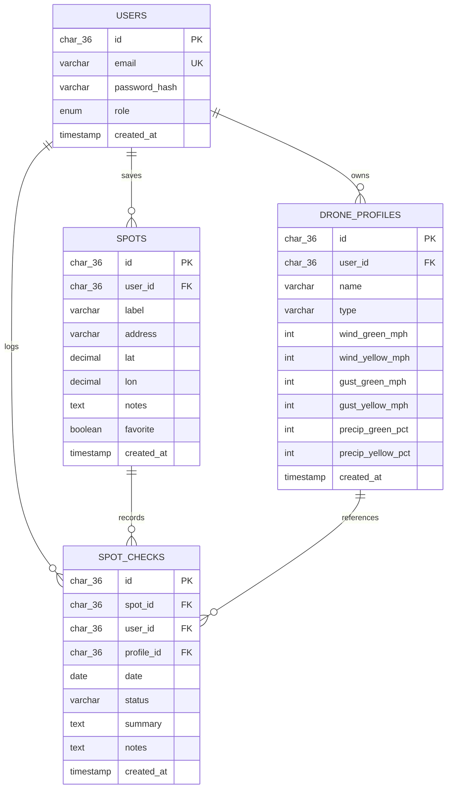

# Entity Relationship Diagram

## ERD

## Design Notes

- `users` is the parent entity for authentication and ownership.
- `drone_profiles` stores per-aircraft safety thresholds used during scoring.
- `spots` stores reusable launch locations for each user.
- `spot_checks` ties a user, an optional drone profile, and a chosen spot to a dated operational decision.
- Foreign keys on `spot_checks` preserve referential integrity, and `spot_id` cascades on delete to remove orphaned history when a spot is intentionally deleted.
